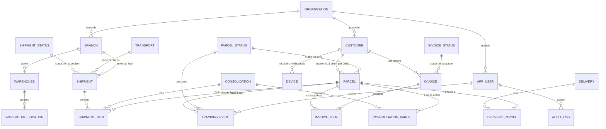
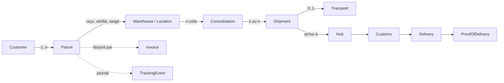
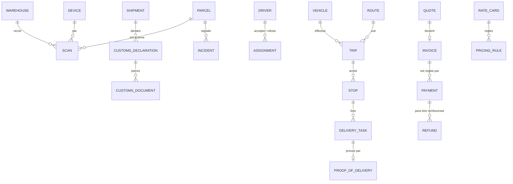

# Relations entre entités

> Les diagrammes se lisent sur GitHub (Mermaid). `||--o{` = « un à plusieurs ». Les colonnes
> montrées sont les clés et celles qui portent la règle, pas toutes les colonnes.

## 1. Ce qui existe (réalisé et testé)

## 2. La chaîne logistique (le fil du récit)

Plein = réalisé en base ; les étapes douane et preuve de livraison viennent aux phases 8 et 9.

## 3. Ce qui est prévu (phases 7 à 10)

## 4. Règles d'intégrité (toutes prouvées par `logistique-essai.py`)
| Règle | Mécanisme |
|---|---|
| Un colis n'est dans qu'**une** consolidation active | index unique partiel `where removed_at is null` |
| Une ligne d'expédition = **une** consolidation **ou** un colis | `check (num_nonnulls(…) = 1)` |
| Pas deux fois la même chose dans une expédition | `unique (shipment_id, consolidation_id)`, `unique (shipment_id, parcel_id)` |
| Statut de colis ≠ statut d'expédition ≠ statut de facture | trois listes, clés étrangères |
| Arrivée après départ | `check (arrived_at >= dispatched_at)` |
| On ne supprime pas ce qui a de l'histoire | `ON DELETE RESTRICT` partout |
| Journaux en ajout seul | déclencheur `forbid_mutation` (`LG004`) |
| Fermé à l'API | RLS sans politique, aucun `grant` (`42501`) |
